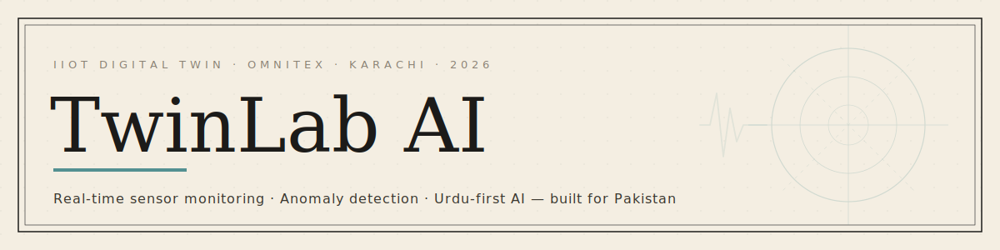
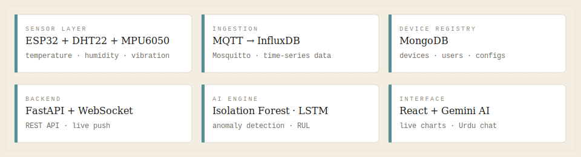

<div align="center">



**Industrial IoT Digital Twin Platform for Pakistan's SMEs and Engineering Institutions**

[](https://python.org)
[](https://fastapi.tiangolo.com)
[](https://influxdata.com)
[](https://mongodb.com)
[](https://docker.com)
[](https://react.dev)
[](https://ai.google.dev)

[]()
[]()

</div>

---

## The problem

> Siemens, GE Predix, AVEVA — the platforms that actually solve industrial monitoring
> cost more per year than most Pakistani SME factories earn in a quarter.
>
> The engineers who need these tools the most can't afford them.
> The students who will build Pakistan's next industrial wave have never touched them.
>
> **TwinLab is the alternative.**

---

## What TwinLab is

<div align="center">


</div>

Two products, one platform.

| | TwinLab Pro | TwinLab Edu |
| :--- | :--- | :--- |
| **Who** | Small/mid manufacturers | Engineering students |
| **What** | Real-time sensor monitoring, anomaly detection, RUL prediction | Virtual experiment canvas, IIoT lab kits |
| **AI** | Isolation Forest · LSTM · Gemini Urdu chat | Coaching assistant |
| **Hardware** | ESP32 + DHT22 + MPU6050 | ESP32-based student kits |
| **Pilot** | HSK Bone Care (orthopedic equipment) | DUET · NED |

`📍 Karachi, Pakistan` &nbsp;·&nbsp; `🏢 OmniteX` &nbsp;·&nbsp; `🎯 NIC Karachi Incubation`

---

## Stack



## Architecture

```
ESP32 Sensors
     │  MQTT
     ▼
Mosquitto Broker (port 1883)
     │
     ▼
ingestion.py ──► InfluxDB 2.7  (time-series readings)
                 MongoDB 7.0   (device registry, users, configs)
                      │
                      ▼
               FastAPI Backend
               ├── REST API  (device registry, readings)
               ├── WebSocket (live push to frontend)
               └── AI layer  (Isolation Forest · LSTM · Gemini)
                      │
                      ▼
               React Dashboard
               └── Live charts · Alerts · Urdu chat
```

---

## Repo structure

| Path | |
| :--- | :--- |
| [`backend/`](./backend) | FastAPI app — device registry, readings API, WebSocket push |
| [`phase/`](./phase) | Phase docs — what was built, steps taken, demo scripts |
| [`ingestion.py`](./ingestion.py) | MQTT subscriber → InfluxDB writer |
| [`simulator.py`](./simulator.py) | Fake ESP32 publisher (no hardware needed) |
| [`test_mqtt.py`](./test_mqtt.py) | Bare MQTT listener for broker sanity check |
| [`docker-compose.yml`](./docker-compose.yml) | Mosquitto + InfluxDB + MongoDB |
| [`mosquitto/`](./mosquitto) | Broker config, data, logs |

---

## Get started

**Pre-requisite:** Docker Desktop running.

```bash
# 1. Start all services
docker compose up -d

# 2. Install dependencies
pip install -r requirements.txt

# 3. Start the ingestion service
python ingestion.py

# 4. Run the simulator (separate terminal)
python simulator.py

# 5. Start the backend
cd backend
uvicorn main:app --reload --port 8000
```

| Service | URL | Credentials |
| :--- | :--- | :--- |
| InfluxDB UI | http://localhost:8086 | admin / twinlab123 |
| API + Swagger | http://localhost:8000/docs | — |
| MQTT broker | localhost:1883 | anonymous |
| MongoDB | localhost:27017 | admin / twinlab123 |

---

## Roadmap

| Phase | Goal | Status |
| :---: | :--- | :---: |
| **1** | MQTT + InfluxDB + MongoDB — sensor data landing in time-series DB | ✅ Done |
| **2** | FastAPI backend — device registry, live readings, WebSocket push | ✅ Done |
| **3** | React dashboard — live charts, alerts, Isolation Forest anomaly detection | 🔄 Next |
| **4** | LSTM RUL model · Gemini Urdu chat · load-shedding mode · NIC demo | ⏳ Planned |

---

## Phase docs

| | |
| :--- | :--- |
| [Phase 1 — Ingestion Pipeline →](./phase/phase-1.md) | What was built, issues hit, verification steps |
| [Phase 2 — FastAPI Backend →](./phase/phase-2.md) | Build steps, endpoints, demo script |

---

## Team

| | Role |
| :--- | :--- |
| **Muhammad Arham Rajput** | CTO · Founder — backend, GenAI, this repo |
| **Wahaj** | Head of Product Engineering — joining Phase 2+ |
| **Kaif** | Co-founder — branding, BD, pitch |

---

<div align="center">

[LinkedIn](https://www.linkedin.com/in/muhammad-arham-rajput) &nbsp;·&nbsp;
[GitHub](https://github.com/Arhamurrahemeen) &nbsp;·&nbsp;
[Email](mailto:arhamurrahemeen@gmail.com)

<br/>


<sub>Living document — updated at the end of every phase.</sub>

</div>
