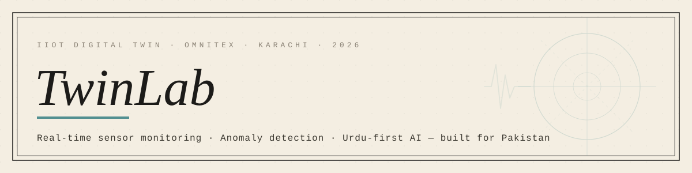
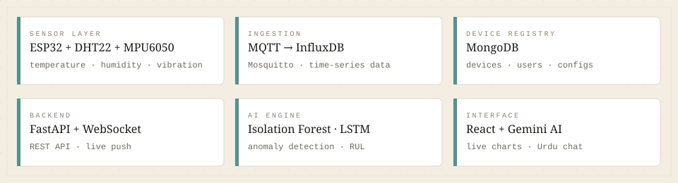

<div align="center">



**Pakistan's SCAPM alternative — non-invasive condition monitoring + push alerts on TwinLab's own app, priced in PKR**

<sub>Supply Chain Asset Performance Management · Generator-first wedge · SME to enterprise (NFL, HSK, Shahruk)</sub>

[](https://python.org)
[](https://fastapi.tiangolo.com)
[](https://react.dev)
[](https://influxdata.com)
[](https://mongodb.com)
[](https://docker.com)
[](https://groq.com)

[]()
[]()

</div>

---

## The problem

> A generator goes down at 2 AM. The owner finds out at 9 AM when the shift manager calls.
> By then the fuel has been stolen, the food-storage compressor has been off for seven hours,
> and the repair bill is three times what a sensor would have cost.
>
> Western monitoring platforms (Siemens, GE Predix, AVEVA) cost more per year than most
> Pakistani SMEs earn in a quarter. **The people who need these tools most can't afford them.**
>
> **TwinLab puts a sensor on your highest-cost asset and pushes you an alert before it fails or gets stolen.**

---

## What TwinLab is

<div align="center">


</div>

**Category:** Supply Chain Asset Performance Management (SCAPM) — Gartner-recognized enterprise software slot alongside Siemens MindSphere, GE Predix, IBM Maximo, PTC ThingWorx. TwinLab occupies the **APM 4.0** sub-slot: wireless condition monitoring + standalone Pakistani cloud, no OT integration required. Same product reaches an SME diesel workshop *and* an NFL Faisalabad plant.

Two products, one engine.

| | TwinLab Pro | TwinLab Edu |
| :--- | :--- | :--- |
| **Who** | SMEs → enterprise (banks · hospitals · telecom · factories · FMCG plants) | Engineering students |
| **Entry point** | Generator monitoring (fuel, load, temperature, vibration) — wedges into full asset registry | Virtual IIoT experiment canvas |
| **Alert channel** | Push notification on the TwinLab Android app (owner) + live web dashboard (ops head) | In-app coaching |
| **AI** | Groq LLaMA — Urdu / Roman Urdu / English | Same |
| **Hardware** | ESP32 + DHT22 + MPU6050 (non-invasive strap-on) | ESP32-based student kits |
| **Pilots** | HSK Bone Care · Shahruk Shell pumps · **NFL POC ask: PKR 25 lac / 10 assets / 3 months** | DUET · NED |

> **Buyer vs user:** the owner is the buyer — he never opens the web dashboard.
> He gets a push notification on the TwinLab app (where he can also glance at the
> asset list and its digital twin). The dashboard is for his ops head or son.

`📍 Karachi, Pakistan` &nbsp;·&nbsp; `🏢 OmniteX` &nbsp;·&nbsp; `🎯 NIC Hyderabad / NIC Karachi`

---

## Architecture

```
ESP32 (real hardware)          simulator.py (registry-driven)
        │                               │
        └──────────── MQTT ─────────────┘
                          │
                  Mosquitto :1883
                          │
          ┌───────────────┴────────────────┐
          │                                │
    ingestion.py                      main.py
    MQTT → InfluxDB              WS bridge + alert engine
    (time-series)                         │
                                ┌─────────┴──────────┐
                           threshold             fuel-theft
                           rule eval             rule eval
                                │
                         alerts collection
                         (MongoDB) ──► FCM push ──► TwinLab Android app
                                │                   (dashboard · detail · 3D twin)
                         WebSocket push
                                │
                        React Dashboard
                   live charts · alerts panel · Groq chat
```

---

## Stack



| Layer | Choice |
| :--- | :--- |
| Hardware | ESP32 + DHT22 (temp/humidity) + MPU6050 (accel/vibration) |
| Messaging | MQTT via **Mosquitto** |
| Time-series DB | **InfluxDB 2.7** |
| Document DB | **MongoDB 7.0** (device registry, thresholds, alerts, sim control) |
| Backend | **FastAPI** (Python) |
| AI — chat | **Groq** `llama-3.3-70b-versatile` (Urdu / Roman Urdu / English) |
| Alerts | **Firebase Cloud Messaging** push to the TwinLab Android app — bilingual (EN + Roman Urdu), rupee-anchored |
| Frontend | **React + Vite** (recharts) — ops-head web dashboard |
| Buyer app | Native **Kotlin + Jetpack Compose** (`android/`) — Ktor, DataStore, Compose-Canvas digital twin, FCM |
| Deploy | Docker Compose (dev) |

---

## Repo structure

| Path | |
| :--- | :--- |
| [`backend/`](./backend) | FastAPI app — device registry, readings, alerts, WebSocket, Groq chat |
| [`backend/alerts.py`](./backend/alerts.py) | Alert engine — threshold rules, fuel-theft rule, cooldown |
| [`backend/routers/`](./backend/routers) | `devices` · `readings` · `alerts` · `chat` · `rul` · `ws` · `push` |
| [`backend/push.py`](./backend/push.py) | FCM push sender — broadcast alerts to registered device tokens |
| [`frontend/`](./frontend) | React dashboard — live charts, alerts panel, Groq chat FAB |
| [`android/`](./android) | Native Kotlin + Compose app — asset dashboard, live detail, digital twin, FCM push |
| [`sim-control/`](./sim-control) | Simulator control mini-app — generator toggle, base-value sliders, fault injectors |
| [`phase/`](./phase) | Phase docs — plan → build log → actually achieved |
| [`phase/MVP_v2_PLAN.md`](./phase/MVP_v2_PLAN.md) | Authoritative v2 spec (read before expanding any phase) |
| [`phase/limitations.md`](./phase/limitations.md) | Known limitations log |
| [`ingestion.py`](./ingestion.py) | MQTT subscriber → InfluxDB writer (flat script, no changes) |
| [`simulator.py`](./simulator.py) | Registry-driven simulator — reads active devices from Mongo |
| [`docker-compose.yml`](./docker-compose.yml) | Mosquitto + InfluxDB + MongoDB |

---

## Get started

**Prerequisites:** Docker Desktop running, `.venv` created with `pip install -r requirements.txt`.

Run each command in a **separate terminal** from the repo root (`D:\TwinLab_v2`):

```powershell
# 1 — Docker services (Mosquitto + InfluxDB + MongoDB)
docker compose up -d

# 2 — MQTT → InfluxDB ingestion
.venv\Scripts\python ingestion.py

# 3 — Simulator (reads device registry — 5 NFL devices are seeded by default)
.venv\Scripts\python simulator.py

# 4 — FastAPI backend  (--host 0.0.0.0 so the Android app on the LAN can reach it)
cd backend
..\.venv\Scripts\uvicorn main:app --reload --host 0.0.0.0 --port 8000

# 5 — React dashboard
cd frontend
npm run dev
# → http://localhost:5173

# 6 — Simulator control mini-app (optional — toggle generator, sliders, fault
# injectors, plus a Demo Control Panel with 3 one-click demo buttons + Demo Reset)
cd sim-control
npm run dev
# → http://localhost:5174
```

> **Demo run-through:** open sim-control's **Demo Controls** panel at the top of the
> page → click **1. Inject Overheat**, **2. Inject Consumable**, **3. Inject Theft**
> (each targets a fixed NFL demo device from `seed_nfl.py`) and watch alerts land on
> the dashboard + as a push notification on the app. Click **Demo Reset** between runs to clear cooldowns,
> injectors, and run-hours so the next run starts clean.

| Service | URL | Credentials |
| :--- | :--- | :--- |
| Dashboard | http://localhost:5173 | — |
| Sim control | http://localhost:5174 | — |
| API + Swagger | http://localhost:8000/docs | — |
| InfluxDB UI | http://localhost:8086 | admin / twinlab123 |
| MongoDB | localhost:27017 | admin / twinlab123 |
| MQTT broker | localhost:1883 | anonymous |

> **First run:** the simulator publishes nothing until you register a device.
> Open the dashboard → click **+** → set Source = **Simulator**, add sensors
> (e.g. `fuel_level, load_current, temperature`), set thresholds → Register.
> The simulator picks it up within 30 s and starts publishing.

---

## Run the Android app (`android/`)

The buyer surface. Needs the backend from step 4 running with `--host 0.0.0.0`,
and the phone on the **same Wi-Fi** as the laptop.

```powershell
# 1 — find the laptop's LAN IP (the Wi-Fi adapter's IPv4, e.g. 192.168.1.7)
ipconfig | Select-String IPv4

# 2 — one-time: let the phone reach port 8000 through Windows Firewall
#     (run in an ADMIN PowerShell — approve the UAC prompt)
New-NetFirewallRule -DisplayName "TwinLab 8000" -Direction Inbound `
  -LocalPort 8000 -Protocol TCP -Action Allow -Profile Private
```

3. Open `D:\TwinLab_v2\android` in **Android Studio** → let it generate the Gradle
   wrapper and sync (pulls Gradle 8.9 / AGP 8.7.2 / SDK 35).
4. Plug in the phone (USB debugging on) or start an emulator → **Run** `app`.
5. First launch shows a **Settings** screen — enter `http://<laptop-LAN-IP>:8000`
   (the IP from step 1, **not** `localhost`). Save.
6. The asset dashboard loads the 5 seeded NFL devices with live values. Injecting
   a fault from sim-control pushes an alert to the app (live push also needs the
   Firebase step in [`android/README.md`](./android/README.md) — everything else
   works without it).

```powershell
# JVM unit tests (health status, WS parsing, twin mapping) — no device needed
cd android
.\gradlew :app:testDebugUnitTest
```

**App can't reach the backend?** → phone and laptop on the same Wi-Fi · backend
started with `--host 0.0.0.0` · firewall rule added (step 2) · Settings URL uses
the LAN IP with `http://` and `:8000`. Test from the phone's browser:
`http://<laptop-LAN-IP>:8000/health` should return `{"status":"ok"}`.

---

## Roadmap

### Original MVP (phases 1–4) — complete

| Phase | Goal | Status |
| :---: | :--- | :---: |
| 1 | MQTT + InfluxDB + MongoDB — sensor data landing | ✅ |
| 2 | FastAPI backend — device CRUD, readings API, WebSocket push | ✅ |
| 3 | React dashboard — live charts, device list, alerts panel | ✅ |
| 4 | Groq Urdu chat, rule-based RUL, load-shedding banner | ✅ |

### MVP v2 rebuild — generator-first, threshold-alerted, app-first

| Phase | File | Scope | Status |
| :---: | :--- | :--- | :---: |
| A | [phase-5.md](./phase/phase-5.md) | Registry-driven simulator · device schema (`source`, `thresholds`, `status`) | ✅ |
| B | [phase-6.md](./phase/phase-6.md) | Threshold alert engine · fuel-theft rule · `alerts` collection | ✅ |
| C | [phase-7.md](./phase/phase-7.md) | Twilio WhatsApp — bilingual, rupee-anchored | ✅ |
| D | [phase-8.md](./phase/phase-8.md) | Simulator control mini-app (`sim-control/`) | ✅ |
| E | [phase-9.md](./phase/phase-9.md) | Real ESP32 hardware buffer · brand string cleanup | ⏸ Superseded by Phase 13 |
| F | [phase-10.md](./phase/phase-10.md) | NFL/SCAPM reframe — seed 5 NFL devices · brand kill · SIMULATED badge | ✅ |
| G | [phase-11.md](./phase/phase-11.md) | CRM/inventory features — asset registry · consumable auto-reorder · role-based routing | ✅ |
| H | [phase-12.md](./phase/phase-12.md) | Demo choreography — manual injector buttons + Demo Reset + screen-recording backup | ✅ |
| 13 | [phase-13.md](./phase/phase-13.md) | Hardware node — bench-tested ESP-IDF firmware (MPU6050 + DHT22) merged as `TL-01` | ✅ |
| 14 | [phase-14.md](./phase/phase-14.md) | Twilio → FCM push · native Kotlin + Compose Android app (dashboard · digital twin · alerts) | ✅ |

---

## Team

| | Role |
| :--- | :--- |
| **Muhammad Arham Rajput** | Founder & CEO (Technical) — architecture, MQTT, InfluxDB/MongoDB, ESP32, Groq, this repo |

---

<div align="center">

[LinkedIn](https://www.linkedin.com/in/muhammad-arham-rajput) &nbsp;·&nbsp;
[GitHub](https://github.com/Arhamurrahemeen) &nbsp;·&nbsp;
[Email](mailto:arhamurrahemeen@gmail.com)

<br/>


<sub>Living document — updated at the end of every phase.</sub>

</div>
